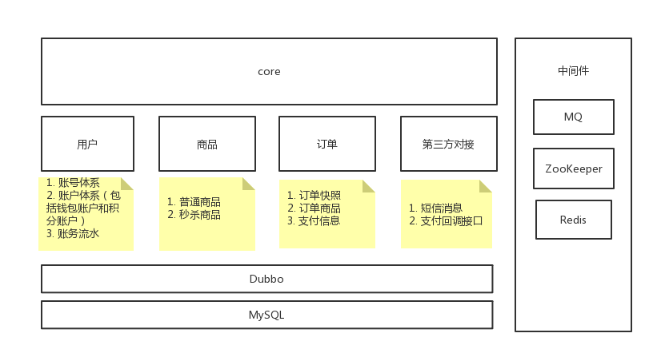

# x-mall
本项目作为一个分布式系统的demo项目

# 系统结构说明
### 1. x-mall-common
通用包
### 2. x-mall-core
核心系统，对外提供RESTful接口
### 3. x-mall-user
用户系统，包括用户信息，账户信息
### 4. x-mall-goods
商品系统，包括商品详情，商品库存
### 5. x-mall-order
订单系统，主要负责订单处理逻辑
### 6. x-mall-simulator
第三方模拟系统，如第三方支付回调等
### 总体架构


# 启动步骤
1. 安装[redis](https://redis.io/)，并启动
2. 安装[RabbitMQ](https://www.rabbitmq.com/)，并启动
3. 安装[ZooKeeper](https://zookeeper.apache.org/)，并启动
4. 安装[MySQL](https://www.mysql.com/)，并启动
5. 修改配置文件，x-mall的配置文件主要分为两大块，第一块为每个包内的.properties文件，里面指定了对应的spring，redis，RabbitMQ，ZooKeeper相关配置；另外一块为项目外的独立配置，当前xmall的配置路径为:/xmall/conf/core/jdbc.properties，若是windows系统，则放置于项目同目录下即可，该目录当前只包含jdbc相关配置
之所以将配置分为两部分，主要考虑到项目内的.properties是各开发人员或环境公用的，而项目外的配置文件可以做到各开发人员或环境隔离互不干扰，本项目只是提供这两种配置的使用样例。实际使用的时候一般有一个独立的配置中心，可以将所有配置文件都放置于项目内并做到各开发人员或环境独立性。jdbc.properties实例：
    ```
        spring.datasource.url=jdbc:mysql://192.168.1.10:3306/x-mall?useUnicode=true&characterEncoding=utf8&autoReconnect=true&useServerPrepStmts=true&cachePrepStmts=true
        spring.datasource.jdbc-url=jdbc:mysql://192.168.1.10:3306/x-mall?useUnicode=true&characterEncoding=utf8&autoReconnect=true&useServerPrepStmts=true&cachePrepStmts=true
        spring.datasource.username=root
        spring.datasource.password=root
        spring.datasource.driverClassName=com.mysql.jdbc.Driver
        spring.datasource.testOnBorrow=true
        spring.datasource.validationQuery=SELECT 1

    ```
6. 初始化数据库，执行x-mall-common模块下db/init.sql文件
7. 启动x-mall相关子模块，除开x-mall-common最为通用依赖模块不需要单独启动，其他模块都需要独立启动，另外当前x-mall-goods模块依赖于x-mall-order模块，所以在启动x-mall-goods模块之前需启动x-mall-order模块，其他顺序没有要求
8. 所有的对外接口都在x-mall-core模块中，并且已经提供了初始数据生成的接口，主要包括：
    ```
    /user/create/{username}/{mobile} //创建用户
    /user/batchCreateUser/{num}  //批量创建用户，以及其关联账户
    /goods/batchCreateGoods/{num} //批量生成商品
    /goods/setAllGoodsStock/{stock} //设置所有商品库存
    ```
   主要的业务接口有：
   ```
   /goods/kill/{uid}/{goodsId} //秒杀特定商品，若uid或goodsId传入负数，则系统会随机选取购买用户与对应商品
   /order/payByBalance/{orderId} //使用账户余额支付订单
   ```
   除此之外，还可使用x-mall-simulator模拟客户端异步支付以及第三方支付回调等
   ```
   /simulator/wxPay/{orderNo}  //微信支付接口
   /simulator/wxPayCallback/{orderNo} //支付回调接口
   ```
